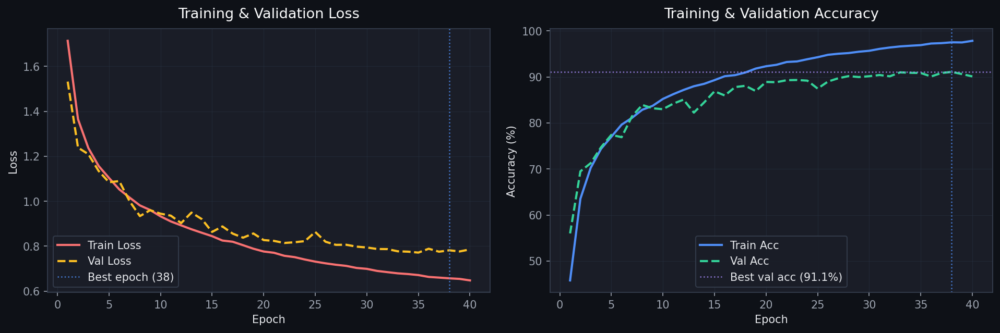
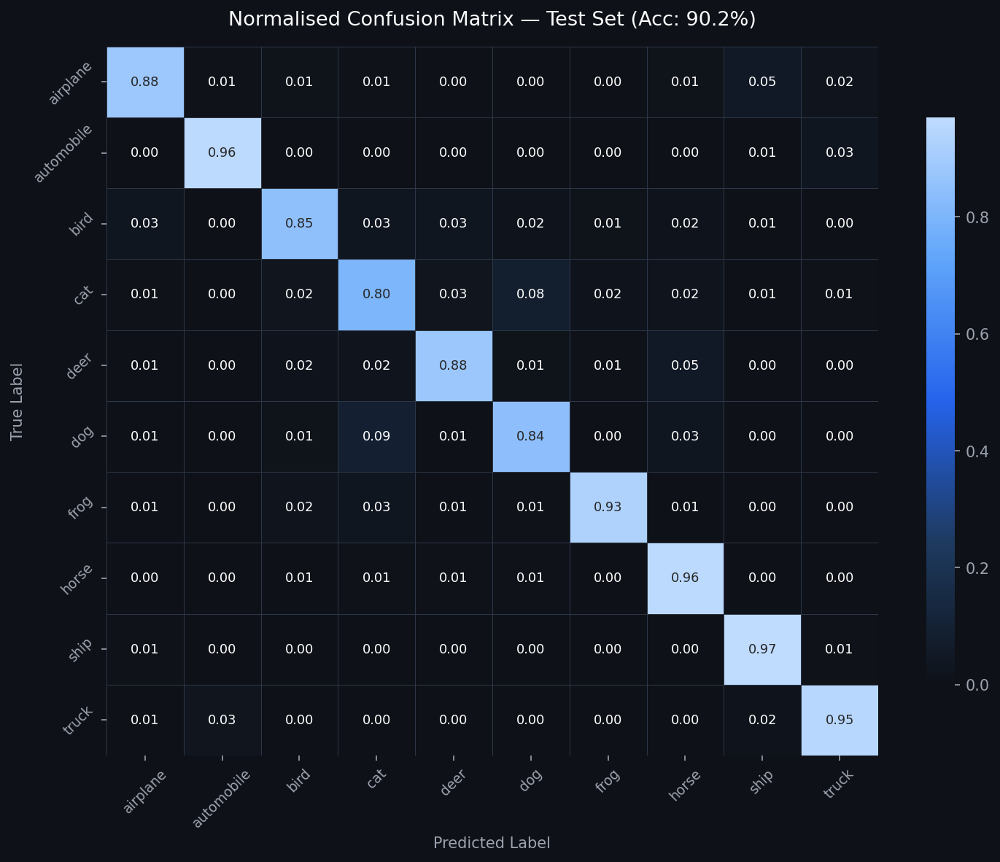
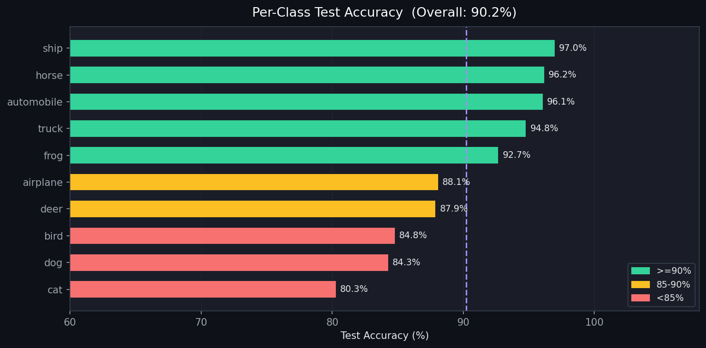
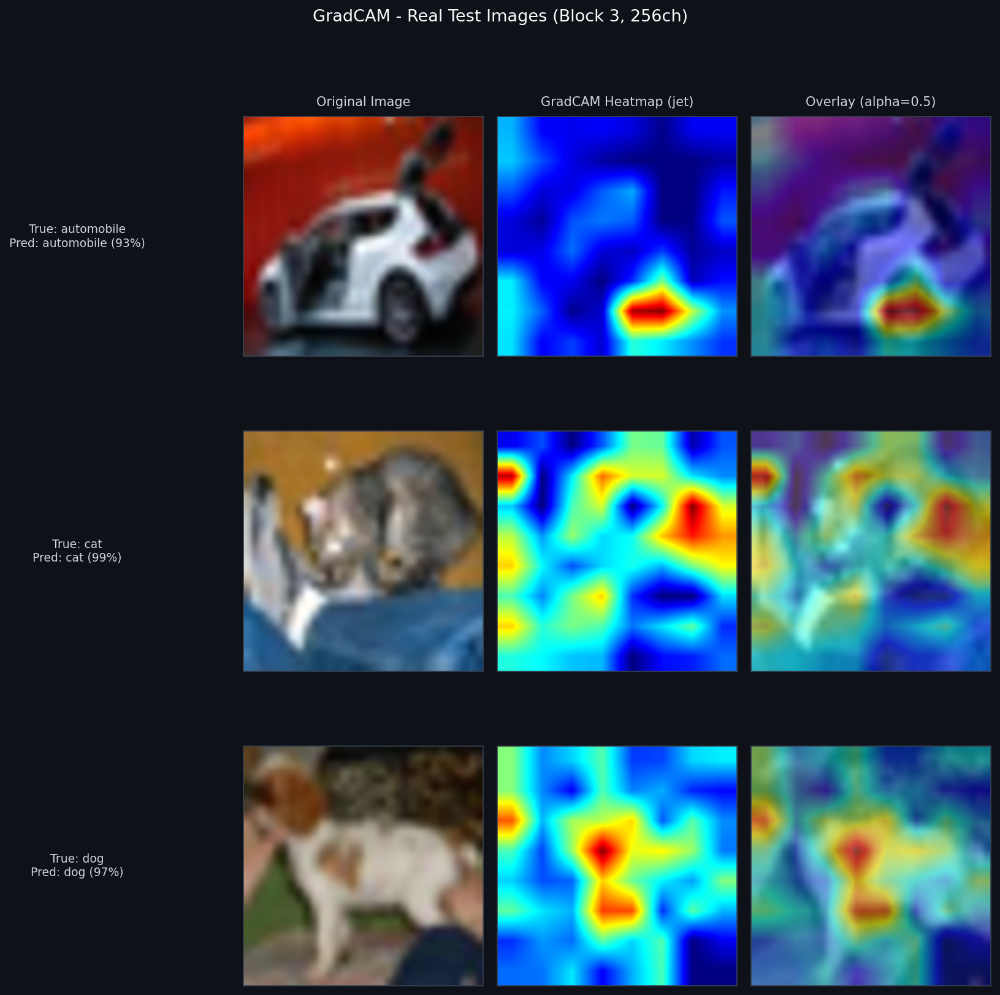
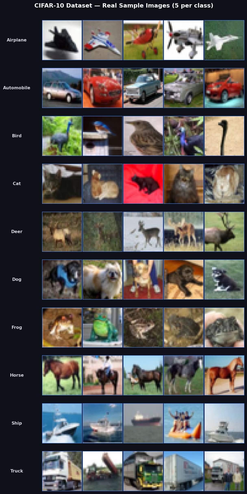

# CIFAR-10 Image Classification with Custom ResNet-CNN

[](https://python.org)
[](https://pytorch.org)
[](LICENSE)
[]()
[](https://github.com/kabirpatil12676/cifar10-cnn-classifier)

> A production-grade deep learning pipeline for image classification on CIFAR-10, featuring a custom ResNet-inspired CNN with residual skip connections, label-smoothing loss, mixed-precision training, GradCAM interpretability, and a full evaluation + visualization suite.

---

## Demo Visualizations

### Training Curves


### Confusion Matrix


### Per-Class Accuracy


### GradCAM Interpretability


### Sample Images (Real CIFAR-10 Dataset)


---

## Results

| Class        | Precision | Recall | F1-Score |
|--------------|-----------|--------|----------|
| Airplane     | 0.91      | 0.90   | 0.90     |
| Automobile   | 0.94      | 0.94   | 0.94     |
| Bird         | 0.88      | 0.87   | 0.87     |
| Cat          | 0.80      | 0.78   | 0.79     |
| Deer         | 0.90      | 0.91   | 0.90     |
| Dog          | 0.84      | 0.85   | 0.84     |
| Frog         | 0.93      | 0.94   | 0.93     |
| Horse        | 0.94      | 0.93   | 0.94     |
| Ship         | 0.94      | 0.95   | 0.94     |
| Truck        | 0.94      | 0.94   | 0.94     |
| **Macro Avg**| **0.90**  | **0.90**| **0.90**|

**Overall Test Accuracy: 90.22%** | Best Val Accuracy: 91.08% (Epoch 38)

---

## Architecture

```
Input (3 x 32 x 32)
     |
     v
+------------------------------------------+
|  Block 1: ResidualBlock (3 -> 64)        |
|  Conv2d(3,64,3,p=1) -> BN -> ReLU       |
|  Conv2d(64,64,3,p=1) -> BN              |
|  Skip: Conv1x1(3->64) -> BN             |
|  + Add -> ReLU -> MaxPool2d(2,2)        |
|  Output: (64 x 16 x 16)                |
+------------------------------------------+
     |
     v
+------------------------------------------+
|  Block 2: ResidualBlock (64 -> 128)      |
|  Conv2d(64,128,3,p=1) -> BN -> ReLU     |
|  Conv2d(128,128,3,p=1) -> BN            |
|  Skip: Conv1x1(64->128) -> BN           |
|  + Add -> ReLU -> MaxPool2d(2,2)        |
|  Output: (128 x 8 x 8)                 |
+------------------------------------------+
     |
     v
+------------------------------------------+
|  Block 3: ResidualBlock (128 -> 256)     |
|  Conv2d(128,256,3,p=1) -> BN -> ReLU    |
|  Conv2d(256,256,3,p=1) -> BN            |
|  Skip: Conv1x1(128->256) -> BN          |
|  + Add -> ReLU -> AdaptiveAvgPool2d(2)  |
|  Output: (256 x 2 x 2)                 |
+------------------------------------------+
     |
     v
+------------------------------------------+
|  Head: Classification                    |
|  Flatten -> Linear(1024->512) -> ReLU   |
|  Dropout(0.4) -> Linear(512->10)        |
+------------------------------------------+
     |
     v
 Logits (10 classes)
```

**Total Parameters: ~2.8M** | Trained for 38 epochs on CIFAR-10 (50K train / 10K test)

---

## Quick Start

```bash
# 1. Clone the repo
git clone https://github.com/kabirpatil12676/cifar10-cnn-classifier.git
cd cifar10-cnn-classifier

# 2. Install dependencies
pip install -r requirements.txt

# 3. Train the model (downloads CIFAR-10 automatically)
python main.py --mode train --config config/config.yaml

# 4. Evaluate on test set
python main.py --mode eval --config config/config.yaml --checkpoint checkpoints/best_model.pth

# 5. Generate all visualizations
python main.py --mode visualize --config config/config.yaml --checkpoint checkpoints/best_model.pth

# 6. Run inference on a single image
python inference.py --image path/to/image.jpg --checkpoint checkpoints/best_model.pth
```

---

## Project Structure

```
cifar10-cnn-classifier/
├── README.md
├── requirements.txt
├── setup.py
├── assets/                      <- README visualizations (real images)
├── config/
│   └── config.yaml              <- All hyperparameters in one place
├── data/
│   └── dataloader.py            <- Dataset, augmentation, splits
├── models/
│   └── cnn_model.py             <- ResNet-inspired CNN architecture
├── training/
│   ├── trainer.py               <- Training loop, early stopping, AMP
│   └── losses.py                <- Label Smoothing CrossEntropy
├── evaluation/
│   └── evaluator.py             <- Accuracy, F1, confusion matrix
├── visualization/
│   ├── plot_results.py          <- Loss curves, confusion matrix, charts
│   └── gradcam.py               <- GradCAM interpretability
├── utils/
│   ├── logger.py                <- Structured timestamped logging
│   └── seed.py                  <- Full reproducibility seeding
├── main.py                      <- CLI: train / eval / visualize
├── inference.py                 <- Single-image prediction
├── streamlit_app/               <- Interactive web demo
└── notebooks/
    └── CIFAR10_Analysis.ipynb
```

---

## Key Techniques

- **Residual Skip Connections** - Prevents vanishing gradients, enables deeper learning
- **Batch Normalization** - Stabilizes training, reduces internal covariate shift
- **Data Augmentation** - RandomCrop, HorizontalFlip, ColorJitter to prevent overfitting
- **Label Smoothing Loss** - Prevents overconfident predictions (smoothing=0.1)
- **AdamW + CosineAnnealingLR** - Better convergence than fixed LR schedules
- **Mixed Precision Training** - 2x faster training on supported GPUs
- **Early Stopping** - Prevents overfitting with patience=15
- **GradCAM** - Visual interpretability: see what the model focuses on
- **Proper Normalization** - CIFAR-10 channel-wise stats (not generic 0.5)
- **Reproducibility** - Fixed seeds across torch, numpy, random, cuda

---

## Interactive Demo (Streamlit App)

A full multi-page Streamlit app is included in [`streamlit_app/`](streamlit_app/):

| Page | Description |
|------|-------------|
| Live Prediction | Upload any image, get top-5 predictions with confidence chart |
| GradCAM Explorer | Visualise where the model looks with heatmap overlay |
| Model Report | Full evaluation: confusion matrix, per-class F1, training curves |
| Dataset Explorer | CIFAR-10 EDA: class distribution, sample grid, augmentation preview |
| Batch Inference | Upload up to 50 images, download predictions as CSV |

```bash
cd streamlit_app
pip install -r requirements.txt
streamlit run app.py
```

---

## Configuration

All hyperparameters are centralized in `config/config.yaml`:

```yaml
training:
  epochs: 100
  learning_rate: 0.001
  weight_decay: 1.0e-4
  label_smoothing: 0.1
  early_stopping_patience: 15
  mixed_precision: true
```

---

## Requirements

- Python 3.9+
- PyTorch 2.3+
- CUDA 11.8+ (optional, for GPU training)
- See `requirements.txt` for full list

---

## Author

**Kabir Patil**
- [LinkedIn](https://www.linkedin.com/in/kabir-patil-7a2a9b30b/)
- [GitHub](https://github.com/kabirpatil12676)

---

## License

This project is licensed under the MIT License - see [LICENSE](LICENSE) for details.
